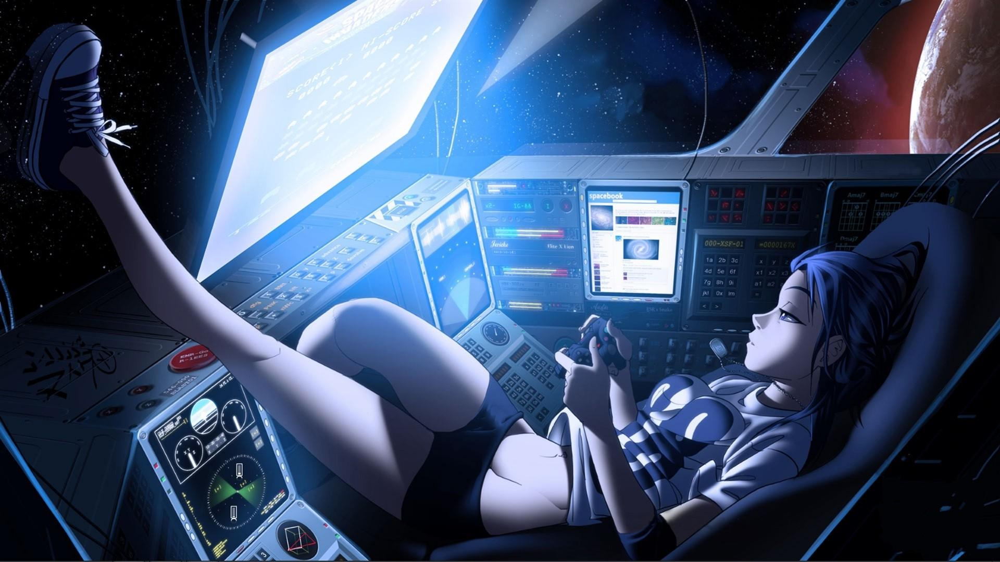

# esLIEB
Theme for emulationstation, featuring that gaming girl in a spaceship.
The theme is based on Carbon. Unsupported systems will show up in the Carbon look.

There are several colourings, just overwrite the LIEB.xml file with the right file:

cd ../esLIEB  
cp LIEB_green.xml LIEB.xml  

Colours:  
Pink:  	LIEB_pink.xml 	--> Because it is a girl in a spaceship. I heard girls love pink. ;P  
Rose:  	LIEB_rose.xml 	--> The second girly theme, based on pink.  
Green: 	LIEB_green.xml	--> Computerish green.  

Supported Systems (Tested):

+  Desktop (same as pixeldesktop)  
+  RetroPie Settings  
+  Nintendo Entertainment System  
+  Super Nintendo  
+  Sega Master System  
+  Atari 2600  

Supported Systems (Not tested):

+  3DO  
+  Adventure Game System  
+  AmstradCPC  
+  Amiga  
+  Apple 2  
+  Arcade  
+  Atari 800  
+  Atari 5200  
+  Atari 7800  
+  Atari Jaguar  
+  Atari Lynx  
+  Atari ST  
+  BBC Micro  
+  C64  
+  Channel F  
+  Coco  
+  ColecoVision  
+  Daphne  
+  Dragon 32  
+  Sega DreamCast  
+  FBA  
+  Nintendo Famicon Disk System  
+  Nintendo Game & Watch  
+  Sega GameGear  
+  Nintendo GameBoy  
+  Nintendo GameBoy Advance  
+  Nintendo GameBoy Color  
+  Sega Genesis  
+  Intellivision  
+  Kodi  
+  Löve  
+  Apple Macintosh  
+  Mame  
+  Mame (Advmame)  
+  Mame (Libretro)  
+  Mame (Mame4All)  
+  Sega MegaDrive  
+  Mess  
+  MSX  
+  Nintendo 64  
+  Nintendo DS  
+  NeoGeo  
+  NeoGeo Pocket  
+  NeoGeo Pocket Color  
+  Odyssey 2  
+  ORIC  
+  PC  
+  PCE-CD  
+  PC Engine  
+  Ports  
+  Sony PlayStation  
+  Sony PlayStation 2  
+  Sony PlayStation Portable  
